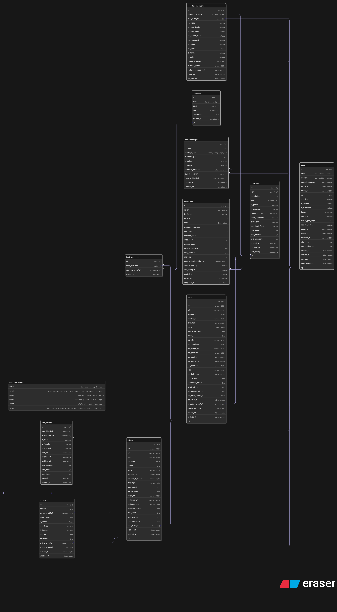

# SUPRSS – Documentation du cycle de conception & migration de la base PostgreSQL

## 1. Contexte & objectifs

- **But** : mettre en place, sur Azure PostgreSQL Flexible Server, un schéma relationnel complet pour la plate‑forme SUPRSS (agrégateur RSS collaboratif).
- **Contraintes principales** :
  - Stack **FastAPI + SQLAlchemy 2 + Alembic**.
  - Intégration continue (Docker Compose dev / Azure DevOps).
  - Documentation technique exhaustive : code → schéma DB → diagrammes.

---

## 2. Toolchain & environnement

Pour concevoir notre base de données et ses tables, nous avons utilisé les outils suivants :

| Outil                          | Rôle                                | Version/config clé    |
|--------------------------------|-------------------------------------|-----------------------|
| **PostgreSQL Flexible Server** | SGBD managé Azure                   | 15                    |
| **Python**                     | Backend                             | 3.12                  |
| **SQLAlchemy**                 | ORM                                 | 2.0.x (`async` ready) |
| **Alembic**                    | Migrations                          | 1.13+                 |
| **DBeaver**                    | Inspections & ERD                   | 24.1                  |
| **Eraser.io**                  | Génération du diagramme relationnel | Mark‑flow support     |

> **Tip CI** : le fichier`.azcli` provisionne l’instance Flexible Server avec le parameter set *“General Purpose / 2vCores / Standard ****D2s\_v3****”*.
> La configuration de PostgreSQL Flexible Server est faite précédemment dans le fichier [Database Azure Configuration](1.%20Database%20Azure%20Configuration.md).

---

## 3. Étapes suivies

### 3.1 Définition du noyau de modèles

1. **Listing fonctionnel → tables** : *User, Collection, CollectionMember, Feed, Category, FeedCategory,* …
2. **Modélisation SQLAlchemy** : chaque module `app/models/*.py` contient :
   - Attributs typés (index, uniques, defaults).
   - FKs explicites + `relationship()` symétriques.
   - Enums Python ⭢ `Enum(..., create_type=False)` pour déléguer la création à Alembic.
3. **Conventions** : `naming_convention` SQLA, timestamps UTC, `id` SERIAL.

### 3.2 Première migration `init schema`

| Symptom                                          | Root‑cause                                | Fix                                                                                 |
|--------------------------------------------------|-------------------------------------------|-------------------------------------------------------------------------------------|
| `No 'script_location' key found`                 | `alembic.ini` absent de la racine backend | Init scaffold`alembic init backend/migrations` puis mapping dans `pyproject.toml`   |
| `Can't load plugin: sqlalchemy.dialects:driver`  | url `postgres://…` mal injectée           | Set `config.set_main_option("sqlalchemy.url", settings.database_url)` dans *env.py* |
| `environment script does not provide a MetaData` | `target_metadata` non référencé           | `from backend.app.core.database import Base ; target_metadata = Base.metadata`      |

> **Leçon 1 :** tenir séparées *configuration* (ini) et *runtime* (env.py) ; injecter les valeurs dynamiques via **settings**.

### 3.3 Erreurs d’enum & doublons

| Erreur                                                        | Description                                                       | Correctif                                                                         |
|---------------------------------------------------------------|-------------------------------------------------------------------|-----------------------------------------------------------------------------------|
| `type "messagetype" does not exist`                           | Alembic tentait d’ajouter une colonne Enum avant de créer le type | 1) Créer le TYPE dans le script init ou `create_type=False` coté modèle.          |
| `invalid input value for enum chat_message_type_enum: "text"` | Valeur par défaut en minuscules alors que l’enum SQL était en MAJ | Harmoniser : Enum Python `TEXT` ; `server_default=MessageType.TEXT.value`.        |
| `type "feedstatus" already exists`                            | Script v2 recréait un ENUM déjà présent                           | `checkfirst=True` ou `execute('DROP TYPE IF EXISTS ... CASCADE')` dans *upgrade*. |

> **Leçon 2 :** garder une **source unique** pour les Enums ; préférez `create_type=False` sur les modèles et gérer la création dans la première révision uniquement.

### 3.4 Reset complet & clean init v2

1. **Purge schema** via script PL/pgSQL (DROP all tables + enums).
2. **Suppression** dossier *backend/migrations/versions* & table `alembic_version`.
3. `alembic revision --autogenerate -m "initial schema v2"` ; inspection manuelle du diff.
4. `alembic upgrade head` → succès.
5. **Vérification** sous DBeaver :
   - 11 tables, 3 enums, 60+ FKs.
   - Exécution de requêtes d’insertion / FK pour valider l’intégrité.

---

## 4. Diagrammes ERD / UML

1. **Export DBeaver** → *Database Navigator ▸ Diagrams ▸ ERD* → PNG (cf. `docs/uml_diagrams/db_schema_2025‑08‑06.png`).
2. Pour visualiser le schéma relationnel de manière dynamique, nous avons utilisé 
   l’outil **Eraser.io** pour générer un diagramme ERD à partir du code SQLAlchemy.

   - **Diagramme ERD** : 
   - **Code source** : fichier `docs/uml/db_schema.er` pour app.Eraser.io.
   - Exemple de code dans le fichier `docs/uml_diagrams/db_schema.er` :
   ```eraser
   users {
    id int [pk]
    email varchar(255) [unique]
    username varchar(50) [unique]
    hashed_password varchar(255)
    full_name varchar(100)
    avatar_url varchar(500)
    bio text
    is_active boolean
    is_verified boolean
    is_superuser boolean
    theme usertheme
    font_size fontsize
    articles_per_page int
    auto_mark_read boolean
    google_id varchar(100)
    github_id varchar(100)
    microsoft_id varchar(100)
    total_feeds int
    total_articles_read int
    created_at timestamptz
    updated_at timestamptz
    last_login timestamptz
    email_verified_at timestamptz
   }
   
   collections {
    id int [pk]
    name varchar(100)
    description text
    slug varchar(100)
    is_public boolean
    is_personal boolean
    owner_id int [ref: > users.id]
    allow_comments boolean
    allow_chat boolean
    auto_fetch_feeds boolean
    total_feeds int
    total_articles int
    total_members int
    created_at timestamptz
    updated_at timestamptz
    last_activity timestamptz
   }
   
   ...
   ```

---

## 5. Problèmes rencontrés & solutions récapitulées

| # | Problème                                  | Solution rapide                                                                     |
|---|-------------------------------------------|-------------------------------------------------------------------------------------|
| 1 | Mauvais chargement de l’URL dans *env.py* | `engine_from_config` ➜ passer `prefix="sqlalchemy."` & injecter `url` dans `config` |
| 2 | Enum déjà existant                        | `DROP TYPE IF EXISTS` avant `CREATE TYPE`, ou `checkfirst=True`                     |
| 3 | Valeur par défaut invalide vs Enum        | Toujours utiliser `MessageType.TEXT.value` et pas `'text'` statique                 |
| 4 | `target_metadata` manquant                | Importer `Base.metadata`                                                            |
| 5 | Reset complet                             | Script PL/pgSQL + suppression table `alembic_version`                               |

---

## 6. Modèle relationnel des données

Vue d’ensemble : chaque table est décrite avec son identifiant primaire (PK), 
ses clés étrangères (FK) et les index/importants. Les notations [PK], [FK → …], [IX] sont utilisées pour la lisibilité ; 
elles correspondent à ce qui a été généré par Alembic et vérifié dans DBeaver.

| Table                  | Colonnes & contraintes clés                                                                                                                                                                                 |
|------------------------|-------------------------------------------------------------------------------------------------------------------------------------------------------------------------------------------------------------|
| **users**              | `id [PK]`, `email [U, IX]`, `username [U, IX]`, `hashed_password`, `is_active`, `is_verified`, `is_superuser`, `theme`, `font_size`, `google_id [IX]`, `github_id [IX]`, `microsoft_id [IX]`, timestamps, … |
| **collections**        | `id [PK]`, `owner_id [FK → users.id, IX]`, `name [IX]`, `slug [IX]`, toggles (is_public, allow_chat, …), stats, timestamps                                                                                  |
| **collection_members** | `id [PK]`, `collection_id [FK → collections.id, IX]`, `user_id [FK → users.id, IX]`, permissions, invitation metadata, timestamps                                                                           |
| **feeds**              | `id [PK]`, `collection_id [FK → collections.id, IX]`, `created_by [FK → users.id, IX]`, `url [U, IX]`, `status (enum feedstatus)`, metadata, timestamps                                                     |
| **categories**         | `id [PK]`, `name [U, IX]`, `color`, `icon`, `description`, `created_at`                                                                                                                                     |
| **feed_categories**    | `id [PK]`, `feed_id [FK → feeds.id, IX]`, `category_id [FK → categories.id, IX]`, `created_at`                                                                                                              |
| **articles**           | `id [PK]`, `feed_id [FK → feeds.id, IX]`, `guid [IX]`, `(guid, feed_id) [U composite]`, author, timestamps, … + index `(feed_id, published_at)`                                                             |
| **user_articles**      | `id [PK]`, `user_id [FK → users.id]`, `article_id [FK → articles.id]`, flags (is\_read, is\_favorite, …), `(user_id, article_id) [U composite]`, index `(user_id, is_read)` & `(user_id, is_favorite)`      |
| **comments**           | `id [PK]`, `article_id [FK → articles.id, IX]`, `author_id [FK → users.id, IX]`, `parent_id [self‑FK]`, mod flags, hierarchy, timestamps                                                                    |
| **chat_messages**      | `id [PK]`, `collection_id [FK → collections.id, IX]`, `author_id [FK → users.id, IX]`, `reply_to_id [self‑FK]`, `message_type (enum chat_message_type_enum DEF TEXT)`, timestamps                           |
| **import_jobs**        | `id [PK]`, `user_id [FK → users.id, IX]`, `target_collection_id [FK → collections.id]`, file metadata, `status (enum importstatus)`, timestamps                                                             |

### 6.1. Contraintes d’intégrité essentielles

```erDiagram
    users ||--o{ collections : "owns"
    users ||--o{ collection_members : "member"
    users ||--o{ chat_messages : "writes"
    users ||--o{ user_articles : "read/fav"
    users ||--o{ comments : "comments"
    users ||--o{ import_jobs : "imports"

    collections ||--o{ collection_members : "has members"
    collections ||--o{ feeds : "contains"
    collections ||--o{ chat_messages : "chat"
    collections ||--o{ import_jobs : "target"

    feeds ||--o{ articles : "publishes"
    feeds ||--o{ feed_categories : "tagged"

    categories ||--o{ feed_categories : "group"

    articles ||--o{ user_articles : "interactions"
    articles ||--o{ comments : "discussion"

    comments ||--o{ comments : "replies"
    chat_messages ||--o{ chat_messages : "threads"
```

> Astuce : le bloc mermaid ci‑dessus peut être collé tel quel dans GitHub / GitLab pour afficher le diagramme relationnel live.

---

## 7. Bonnes pratiques retenues

1. **Convention de nommage** via `naming_convention` pour éviter les diff inutiles.
2. **Enums** : un seul point de création ; `create_type=False` dans les modèles.
3. **Migrations unitaires** : ne jamais ré‑autogénérer tout le schéma ; préférer des incréments courts.
4. **Validation** : toujours *review* le script `versions/*.py` avant `upgrade`.
5. **Documentation live** : exporter l’ERD à chaque révision stable.

---

### 8. Conclusion
La mise en place du schéma relationnel pour SUPRSS a été réalisée avec succès, 
en respectant les contraintes techniques et en appliquant les bonnes pratiques de modélisation. 
Le processus de migration a permis de créer une base solide pour le développement futur, 
avec une documentation claire et des diagrammes ERD à jour.

## Étapes suivantes

- Mettre en place les **tests d’intégration** (`pytest + asyncpg`) pour vérifier les contraintes.
- Automatiser un **lint SQLAlchemy** (sqlalchemy‑sieve) dans CI.
- Ajouter des **migrations data** (fixtures catégories par défaut).

