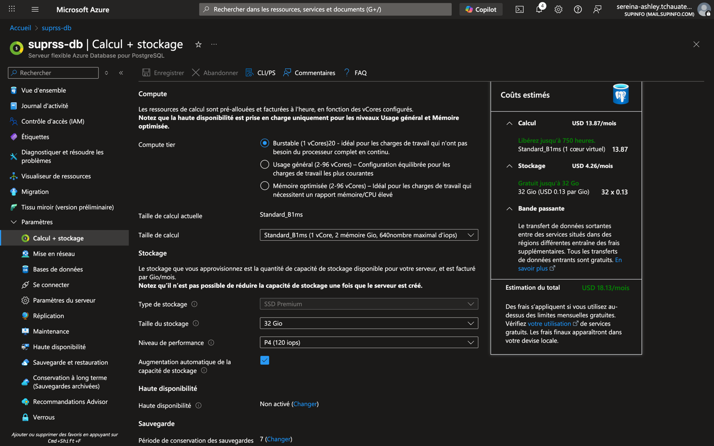
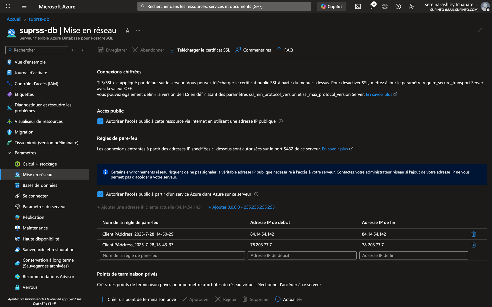
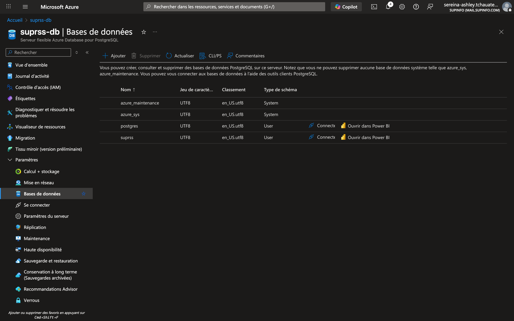
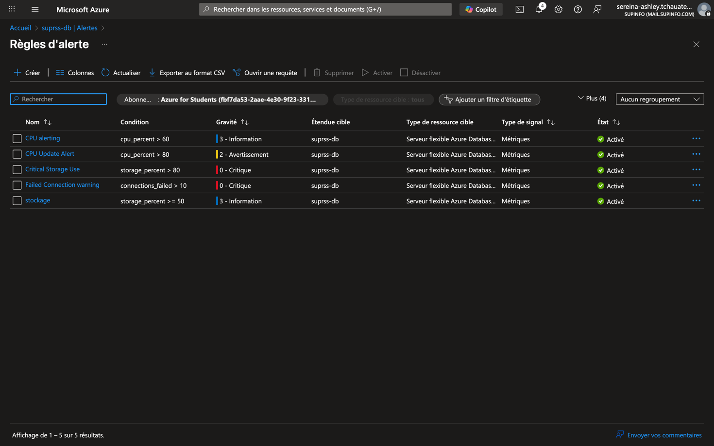
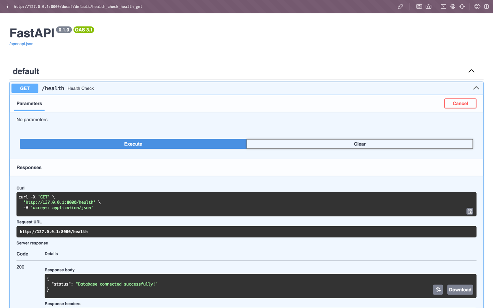

## 1. Base de données : Azure PostgreSQL (Flexible Server)

### 1.1 Objectif  
Notre objectif durant ce projet etait de mettre en place une base de données PostgreSQL managée sur Azure, 
afin de bénéficier d'une solution sécurisée et évolutive sans avoir à gérer l'infrastructure sous-jacente. 
L'application SUPRSS, qui agrège des flux RSS, nécessite une base de données robuste pour stocker les articles et les métadonnées associées.
Tout cela en minimisant les coûts et en maximisant la facilité de gestion en profitant des sauvegardes, du monitoring et de la haute disponibilité Azure.

### 1.2 Choix et dimensionnement  

| Paramètre                     | Valeur retenue     | Raison                                                   |
|-------------------------------|--------------------|----------------------------------------------------------|
| Offre                         | Flexible Server    | Version la plus récente, reboot indépendant des patchs   |
| Tier                          | **Burstable B1ms** | Coût réduit (~15 $/mois) suffisant pour dev / early prod |
| Stockage                      | 32 Go SSD          | Large pour quelques centaines de milliers d’articles RSS |
| Backup retention              | 7 jours            | Couverture basique, coût minimum                         |
| Version PostgreSQL            | 15                 | Aligné sur images Docker locales                         |
| Option “Allow Azure Services” | **On**             | Simplifie la connexion du backend déployé sur Azure      |

> **Coût estimé** ≈ **20 $/mois**, couvert par le crédit étudiant Azure.

> **Note** : Pour une utilisation en production, il est recommandé de passer à un niveau supérieur (par exemple, General Purpose) pour bénéficier de meilleures performances et d'une plus grande résilience. 
> Mais dans le cadre de la réalisation de ce POC, nous avons pris des paramètres adaptés à un usage de développement et de test.



### 1.3 Procédure de création pas-à-pas  

Pour créer la base de données PostgreSQL sur Azure qui a été fait sur ce projet, vous devez suivre les étapes :

1. **Portal Azure › Create resource › Azure Database for PostgreSQL – Flexible Server**  
2. *Resource group* : `suprss-resources` – *Server name* : `suprss-db`  
3. *Workload* : Development – *Region* : France Central/West Europe (selon votre localisation)  
   - **Note** : Il est recommandé de choisir la région la plus proche de votre équipe pour minimiser la latence.
4. Admin user `suprss_admin` + mot de passe robuste (stocké dans 1Password)  
5. **Compute = Burstable B1ms / Storage = 32 Go / Backups = 7 jours**  
6. Lancer la création (≈ 5 min d'attente).  

### 1.4 Sécurité réseau  

Pour un besoin de confidentialité et de sécurité, 
il est important de configurer les règles de pare-feu pour restreindre l'accès à la base de données. 
Dans le cadre de ce projet, nous n'avons donné accès qu'aux autres services du projet à cette base de données, mais également accès à notre équipe de developpement. 
Voici les étapes à suivre :

| Étape | Action                                                                                                                             |
|-------|------------------------------------------------------------------------------------------------------------------------------------|
| 1     | Menu **Networking → Firewall rules**                                                                                               |
| 2     | Bouton **“Add current IP”** pour ajouter les adresses IP des membres de notre équipe de DEV                                        |
| 3     | Cocher **“Allow Azure services to access this server”** (permettra au backend containerisé d’y accéder sans règle supplémentaire)_ |

> En développement nomade, on peut temporairement autoriser `0.0.0.0–255.255.255.255`, puis resserrer les IP, car empêchent des erreurs lors de déplacements fréquents et également empêche de devoir ajouter à chaque déplacement l'adresse de l'équipe DEV.



### 1.5 Création de la base logique `suprss`

Pour créer la base de données logique `suprss` dans le serveur PostgreSQL, vous pouvez utiliser l'outil Azure Data Studio ou tout autre client PostgreSQL. 
Voici la commande SQL à exécuter :

```sql
CREATE DATABASE suprss
    WITH OWNER = suprss_admin
         ENCODING = 'UTF8'
         CONNECTION LIMIT = -1;
```

> En ce qui concerne le projet présent la création de la base de données s'est fait au travers d'une connexion à pgadmin sous Docker, qui est un outil de gestion de base de données PostgreSQL.
> L'image a été conteunérisée et déployée sur docker dans le fichier docker-compose.yml du projet, permettant ainsi de gérer la base de données PostgreSQL directement depuis l'interface web de pgAdmin.

> Mais il est également possible d'accéder à la base de données ainsi créer avec DBeaver, un autre outil de gestion de base de données PostgreSQL, qui permet d'exécuter des requêtes SQL.

Mais en seconde alternative pour faire cela, vous pouvez également utiliser la commande `psql` depuis votre terminal :

```bash
psql -h <nom_du_serveur> -U <nom_de_l_administrateur> -d postgres -c "CREATE DATABASE suprss;"
```
> **Warning** : Assurez-vous de remplacer `<nom_du_serveur>` et `<nom_de_l_administrateur>` par les valeurs appropriées pour votre serveur PostgreSQL.



### 1.6 Monitoring intégré et gestion

Azure propose des outils de monitoring intégrés pour surveiller les performances de la base de données PostgreSQL et provoquer des alertes. 
Nous avons mis en place des alertes en cas de dépassement de seuils critiques comme l'utilisation élevée du CPU ou de la mémoire, afin de garantir la disponibilité et les performances de l'application SUPRSS.
Mais aussi des alertes en cas de depassement de budget et de problème de connexion à la base de données, ce qui permet de réagir rapidement en cas de panne ou de problème de performance.



>Exemple d'alertes : règle « CPU > 80 % pendant 5 min » envoyée par mail pour mise à jour du CPU.

### 1.7. Intégration avec le backend

Dans le dossier `backend`, nous avons configuré la connexion à la base de données PostgreSQL (simplifiée comme ci dessous) en utilisant les variables d'environnement suivantes :

```python
from pydantic_settings import BaseSettings, SettingsConfigDict
from pydantic import Field

class Settings(BaseSettings):
    postgres_user: str = Field(..., env="POSTGRES_USER")
    postgres_pass: str = Field(..., env="POSTGRES_PASS")
    postgres_host: str = Field(..., env="POSTGRES_HOST")
    postgres_db:   str = Field(..., env="POSTGRES_DB")
    postgres_port: int = Field(5432, env="POSTGRES_PORT")

    model_config = SettingsConfigDict(
        env_file=".env",
        extra="ignore"         # on repassera à 'forbid' plus tard
    )

    @property
    def database_url(self) -> str:
        return (f"postgresql://{self.postgres_user}:"
                f"{self.postgres_pass}@{self.postgres_host}:"
                f"{self.postgres_port}/{self.postgres_db}")
settings = Settings()
```

Le code précédent est présent dans le fichier de configuration `config.py` du backend.

Et l'on peut vérifier que la connexion à la base de données fonctionne correctement dans la documentation de l'API FastAPI à l'adresse `http://localhost:8000/docs` avec la route `/healthcheck` qui renvoie un statut 200 avec un message de `santé` si la connexion est établie.



### 1.8 Problemes rencontrés

Nous avons rencontré quelques problèmes lors de la configuration de la base de données PostgreSQL sur Azure, entre autres :

- **Problèmes de connexion** : Au début, nous avons eu des difficultés à établir une connexion entre le backend et la base de données. Cela était dû à des règles de pare-feu mal configurées. Nous avons dû ajuster les règles de pare-feu pour autoriser l'accès depuis notre environnement de développement.
- **Problèmes de coût** : Bien que nous ayons choisi une configuration économique, nous avons dû surveiller de près les coûts pour éviter les dépassements de budget. Nous avons mis en place des alertes pour être informés en cas de dépassement de seuils critiques.
- **Problèmes de configuration** : La configuration initiale de la base de données a été un peu complexe, notamment en ce qui concerne les paramètres de performance et de sécurité. Nous avons dû passer du temps à comprendre comment optimiser la configuration pour notre cas d'utilisation spécifique.
avec la version managée sur Azure. Nous avons dû trouver des alternatives ou mettre à jour nos outils pour garantir une gestion efficace de la base de données.

Nous avons documenté les autres problèmes rencontrés et les solutions apportées dans le tableau ci-dessous pour référence future :

| Problème                       | Cause                            | Fix                                                         |
|--------------------------------|----------------------------------|-------------------------------------------------------------|
| **Timeout TCP**                | IP non autorisée                 | Ajout règle Firewall                                        |
| **`BaseSettings` introuvable** | Passage Pydantic v1→v2           | Installation `pydantic-settings`                            |
| **`SELECT 1` error**           | SQLAlchemy 2.x requiert `text()` | `db.execute(text("SELECT 1"))`                              |
| **Validation errors**          | Variables d’env non mappées      | `extra="ignore"` temporaire, champs ajoutés progressivement |

### 1.9 Conclusion
La mise en place de la base de données PostgreSQL managée sur Azure a été un succès et nous en ressortons avec une solution robuste et évolutive pour l'application SUPRSS.
Nous avons pu bénéficier des avantages d'une base de données managée, tels que la sécurité, la haute disponibilité et la facilité de gestion, tout en minimisant les coûts.

Cette base de données est maintenant prête pour le déploiement du backend et l'exécution des migrations CI/CD, avec :
- Connexion établie, testée et validée via la route `/healthcheck` du backend.
- Coût ≤ 20 $/mois sous crédits Azure Students. 
- Prêt pour déploiement du backend (Container Apps) et exécution des migrations CI/CD.
